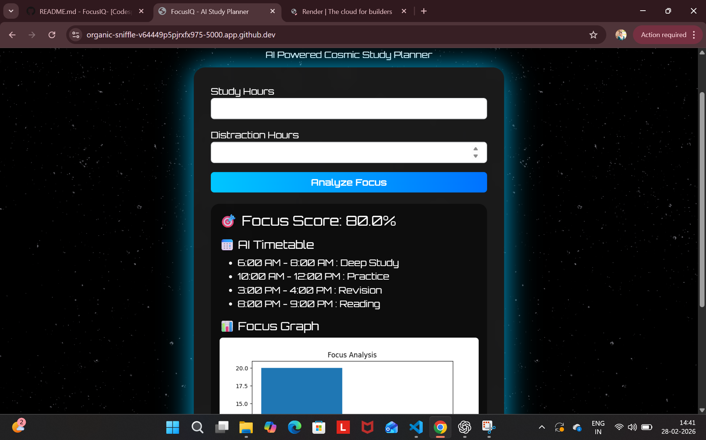

<p align="center">
  
</p>

# Focus-IQ 🎯

## Basic Details

### Team Name: Anusreya shiju

### Team Members
- Member 1: Anusreya Shiju - AISAT,Kalamassery


### Hosted Project Link
[mention your project hosted link here]

### Project Description
**FocusIQ** is an AI-powered smart study planner website that analyzes a student’s study and distraction time to calculate a focus score. Based on the result, it generates a personalized timetable and visual performance graph to improve productivity. The platform uses a modern, interactive space-themed interface to enhance user engagement.


### The Problem statement
Many students struggle with poor time management and excessive distractions, which reduce their focus and academic performance. They often do not know how effectively they are utilizing their study time.

### The Solution
FocusIQ solves this problem by analyzing study hours and distraction time to calculate a focus score. Based on this analysis, it generates a personalized study timetable and visual graph to help students improve concentration and productivity.

---

## Technical Details

### Technologies/Components Used

**For Software:**
- Languages used: HTML , CSS , Python
- Frameworks used: Flask
- Libraries used: 
- Tools used: VS Code, Git


---

## Features

List the key features of your project:
- Feature 1: [Description]
- Feature 2: [Description]
- Feature 3: [Description]
- Feature 4: [Description]

---

## Implementation

### For Software:

#### Installation
```bash
[Installation commands -  pip install flask

```

#### Run
```bash
[Run commands -  python app.py
```


---

## Project Documentation

### For Software:

#### Screenshots (Add at least 3)


*Add caption explaining what this shows*


*Add caption explaining what this shows*


*Add caption explaining what this shows*


#### Demo Output

**Example 1: Basic Processing**

**Input:**
```
This is a sample input file
with multiple lines of text
for demonstration purposes
```

**Command:**
```bash
python script.py sample.txt
```

**Output:**
```
Processing: sample.txt
Lines processed: 3
Characters counted: 86
Status: Success
Output saved to: output.txt
```

**Example 2: Advanced Usage**

**Input:**
```json
{
  "name": "test",
  "value": 123
}
```

**Command:**
```bash
python script.py -v --format json data.json
```

**Output:**
```
[VERBOSE] Loading configuration...
[VERBOSE] Parsing JSON input...
[VERBOSE] Processing data...
{
  "status": "success",
  "processed": true,
  "result": {
    "name": "test",
    "value": 123,
    "timestamp": "2024-02-07T10:30:00"
  }
}
[VERBOSE] Operation completed in 0.23s
```

---

## Project Demo

### Video
[Add your demo video link here - YouTube, Google Drive, etc.]

*Explain what the video demonstrates - key features, user flow, technical highlights*

### Additional Demos
[Add any extra demo materials/links - Live site, APK download, online demo, etc.]

---

## AI Tools Used (Optional - For Transparency Bonus)

If you used AI tools during development, document them here for transparency:

**Tool Used:** [e.g., GitHub Copilot, v0.dev, Cursor, ChatGPT, Claude]

**Purpose:** [What you used it for]
- Example: "Generated boilerplate React components"
- Example: "Debugging assistance for async functions"
- Example: "Code review and optimization suggestions"

**Key Prompts Used:**
- "Create a REST API endpoint for user authentication"
- "Debug this async function that's causing race conditions"
- "Optimize this database query for better performance"

**Percentage of AI-generated code:** [Approximately X%]

**Human Contributions:**
- Architecture design and planning
- Custom business logic implementation
- Integration and testing
- UI/UX design decisions

*Note: Proper documentation of AI usage demonstrates transparency and earns bonus points in evaluation!*

---

## Team Contributions

- [Name 1]: [Specific contributions - e.g., Frontend development, API integration, etc.]
- [Name 2]: [Specific contributions - e.g., Backend development, Database design, etc.]
- [Name 3]: [Specific contributions - e.g., UI/UX design, Testing, Documentation, etc.]

---

## License

This project is licensed under the [LICENSE_NAME] License - see the [LICENSE](LICENSE) file for details.

**Common License Options:**
- MIT License (Permissive, widely used)
- Apache 2.0 (Permissive with patent grant)
- GPL v3 (Copyleft, requires derivative works to be open source)

---

Made with ❤️ at TinkerHub
